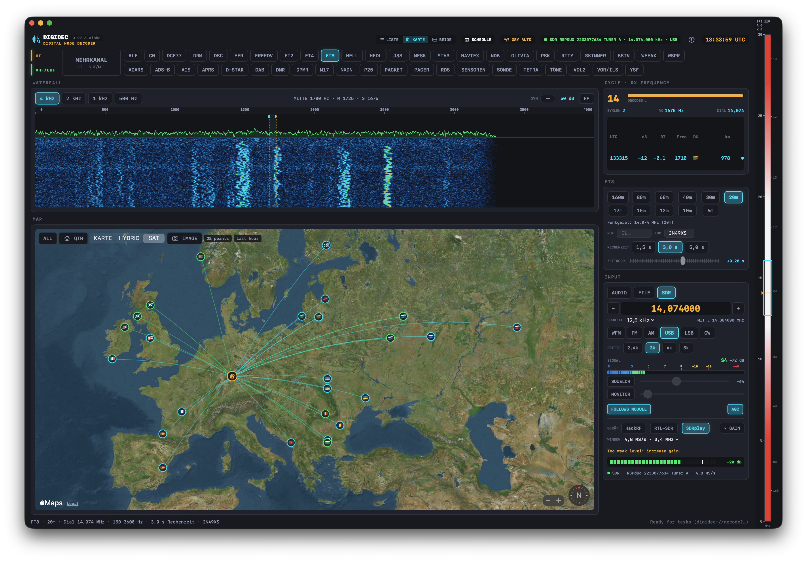
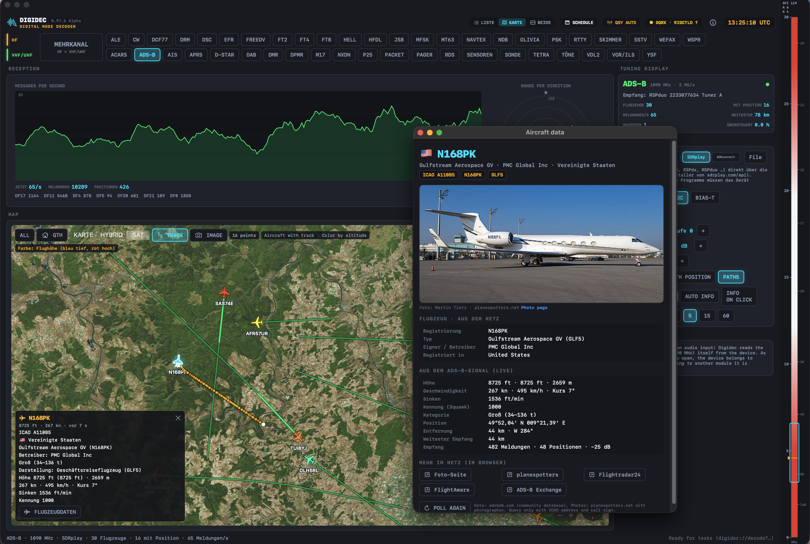
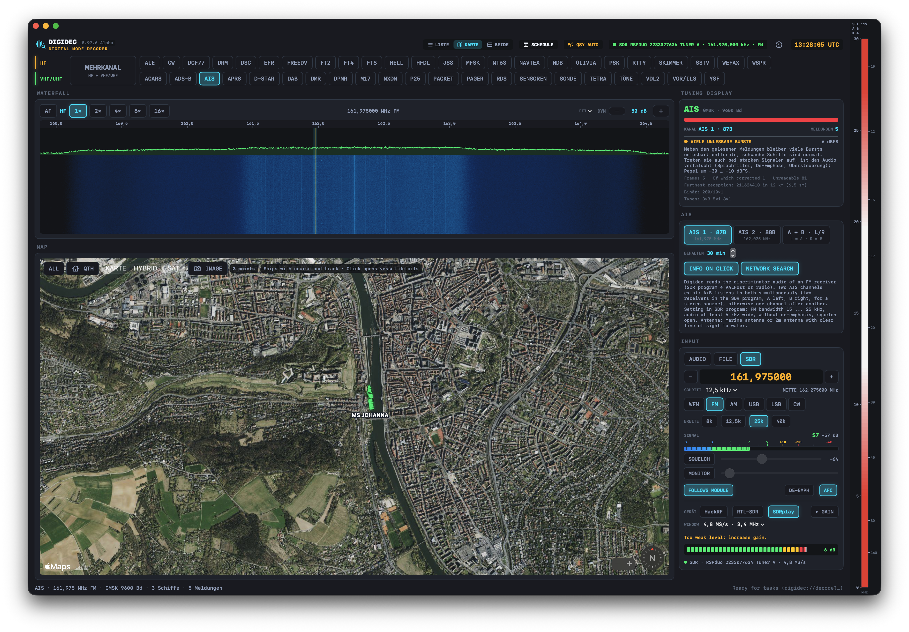
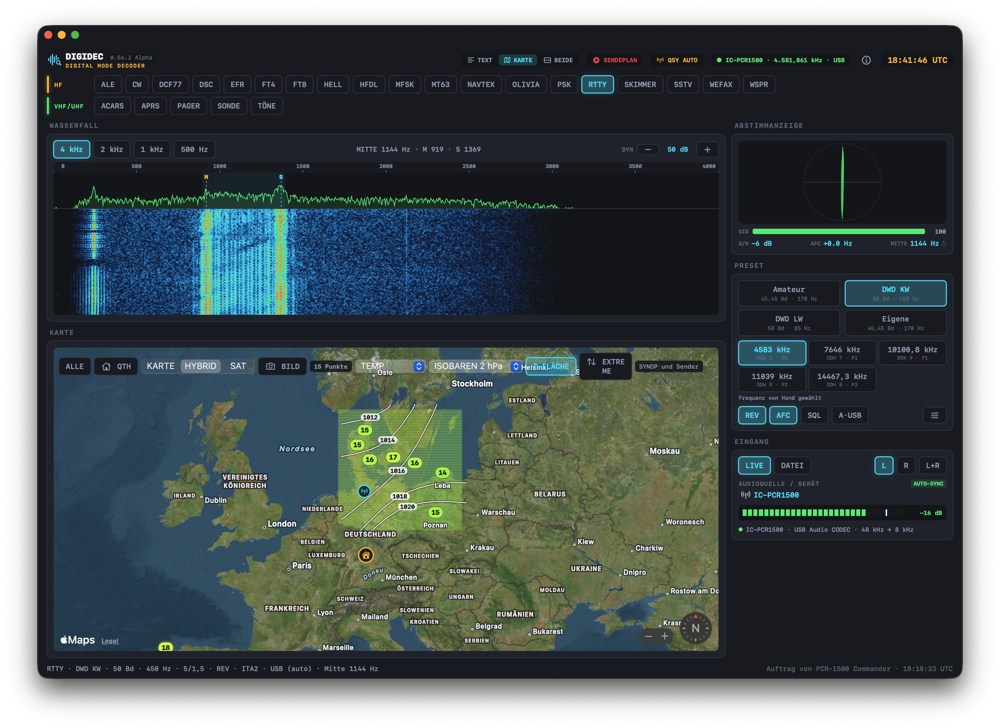
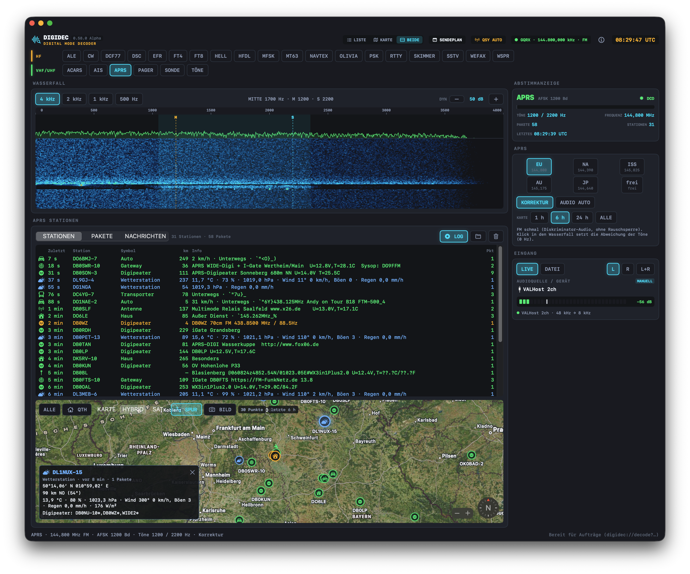
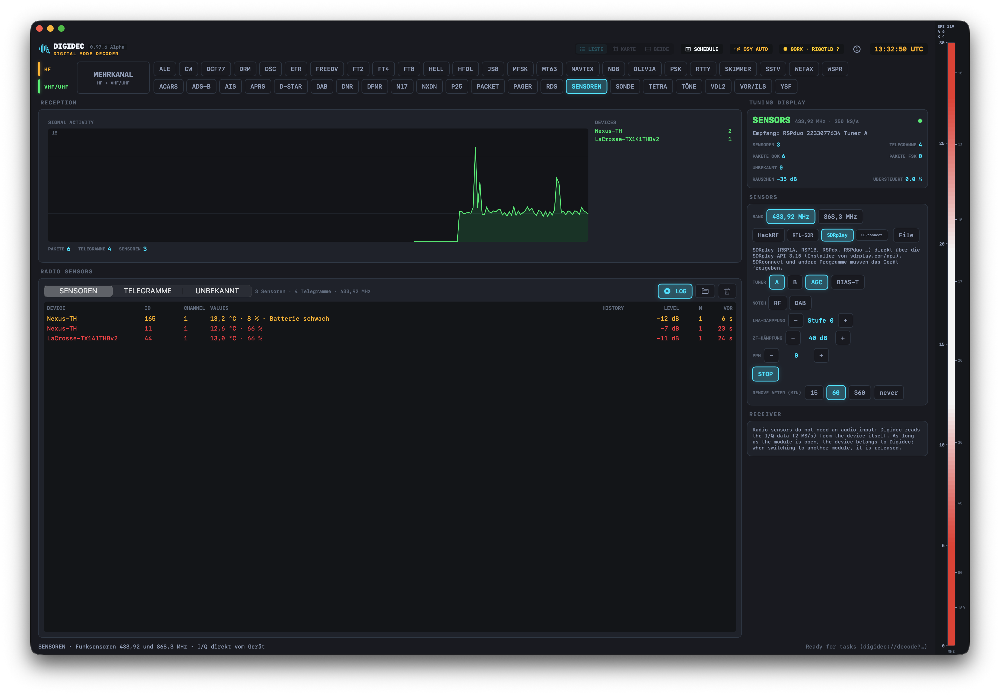
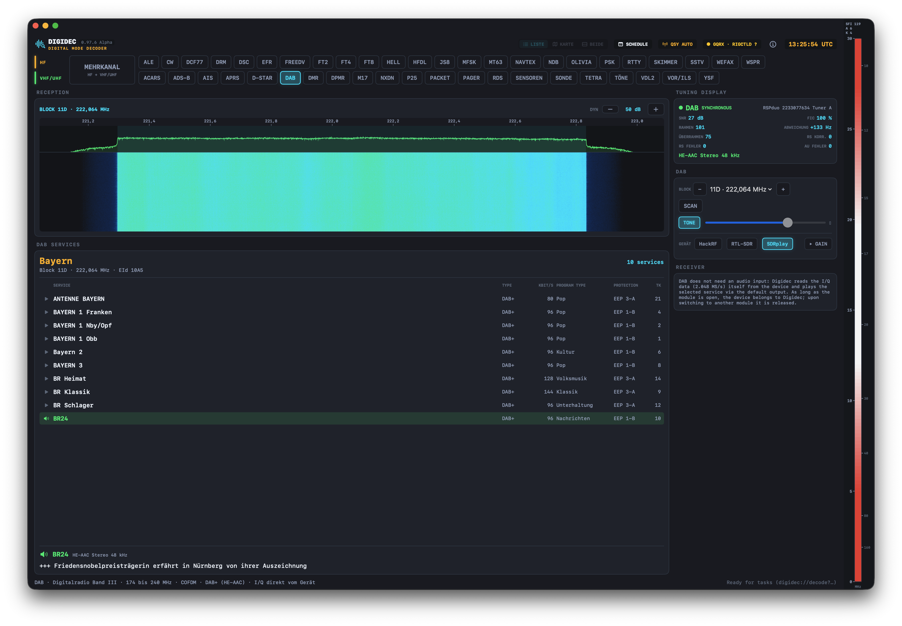

# Digidec

[](https://www.apple.com/macos/)
[](https://swift.org)
[](https://www.gnu.org/licenses/gpl-3.0)
[](https://github.com/betzburger/Digidec/releases)

*Read this in other languages: [Deutsch](README.de.md)*

**Digidec** is a versatile radio data and digital mode decoder designed specifically for macOS. It takes the audio output of an HF/VHF/UHF transceiver or SDR receiver (via USB audio codec, virtual audio cables like BlackHole or VALHost, or direct I/Q streams from SDR hardware) and decodes signals into structured text, images, maps, telemetry, and live waterfall displays.

From marine weather fax and SYNOP teleprinter messages to amateur radio digital modes, digital voice, aviation tracking, maritime vessel monitoring, weather radiosondes, and remote sensor telemetry—Digidec brings them together under a sleek, retro-modern, instrument-grade transceiver UI (`RadioTheme`).

---

<p align="center">
  
  <br>
  <em>Digidec decoding FT8 amateur radio activity with live spectrum, decode list, and interactive station map</em>
</p>

---

> [!WARNING]
> ### ⚠️ Project Status: Early Alpha & Invitation to Test!
> Digidec is currently in active **Alpha status (v0.97.6 Alpha)**. 
> 
> - **Many decoders and features have been mathematically verified against recordings and test vectors, but have not yet undergone extensive live on-air field testing.**
> - Bugs, rough edges, and unexpected quirks may still occur. 
> - **Everyone is warmly invited to test, experiment, and have fun explore the airwaves!** If you encounter issues, decode errors, or have ideas for improvement, feedback and pull requests are very welcome!

---

## 🎙️ Hardware Dongle Requirements for AMBE Voice Decoders

Digidec supports decoding control signaling, framing, callsigns, talkgroups, text messages, and metadata for digital mobile radio and amateur voice standards out-of-the-box. 

However, **proprietary AMBE/AMBE+2 voice synthesis** requires dedicated vocoder hardware:

> [!IMPORTANT]
> ### Digital Voice Decoders Requiring a Hardware USB Dongle
> To listen to live synthesized speech for the following digital voice modes on GitHub builds, an **external AMBE hardware dongle** (e.g., based on the **DVSI AMBE-3000R™ chip**, such as a DVstick30, ThumbDV™, or compatible USB vocoder) must be connected to your Mac:
>
> - **D-STAR** (Digital Voice DV)
> - **DMR** (Digital Mobile Radio / MOTOTRBO™)
> - **YSF** (Yaesu System Fusion / C4FM V/D2)
> - **NXDN** (Kenwood NEXEDGE™ / Icom IDAS™)
> - **dPMR** (digital Private Mobile Radio)
>
> **Without a hardware vocoder stick:** You still receive and decode all headers, callsigns, talker aliases, GPS positions (DPRS), repeater routing, and data packets—the audio stream simply remains muted.
>
> *(Note: Open-source digital voice modes such as **FreeDV** and **M17** use the open **Codec2** vocoder, which is fully built-in and requires **no external hardware**!)*

---

## Visual Showcase

<table width="100%">
  <tr>
    <td width="50%" align="center">
      <br>
      <b>1090 MHz ADS-B Radar</b><br>
      <em>Direct I/Q decoding with directional polar range diagram, flight details, and realistic aircraft silhouettes.</em>
    </td>
    <td width="50%" align="center">
      <br>
      <b>Marine AIS Dual-Channel Tracker</b><br>
      <em>Vessel tracking with speed/heading vectors, ship type silhouettes, search-and-rescue alerts, and vessel database info.</em>
    </td>
  </tr>
  <tr>
    <td width="50%" align="center">
      <br>
      <b>DWD Weather Teleprinter & SYNOP</b><br>
      <em>Offenbach meteorological teleprinter, automated SYNOP/SHIP parsing, isobar mapping, and weather station reports.</em>
    </td>
    <td width="50%" align="center">
      <br>
      <b>APRS 1200 Baud Tracker</b><br>
      <em>AX.25 packet reception, tactical callsign lists, weather telemetry stations, and real-time position tracking.</em>
    </td>
  </tr>
  <tr>
    <td width="50%" align="center">
      <br>
      <b>433.92 / 868.3 MHz ISM Sensors</b><br>
      <em>Direct SDR pulse decoding for over 400 weather stations, thermometers, rain gauges, and pool sensors.</em>
    </td>
    <td width="50%" align="center">
      <br>
      <b>DAB / DAB+ Digital Radio</b><br>
      <em>Band III ensemble receiver, AAC decoding via FAAD2, service information, and Dynamic Label (DLS) display.</em>
    </td>
  </tr>
</table>

---

## Decoder Modules & Capabilities

All modules share a unified waterfall display, flexible audio/SDR input selection, interactive maps, logs, and a clean user experience.

### 🌐 High-Frequency & Longwave (HF / LF)

| Module | Description & Capabilities |
|---|---|
| **RTTY** | Radioteletype with fully configurable Baudot demodulator (compatible with fldigi engine); built-in German Weather Service (DWD) presets; automatic plain-text parsing of SYNOP, SHIP, and BUOY bulletins; isobar weather maps with extreme value highlights. |
| **NAVTEX** | Navigational warnings and maritime safety alerts on 490 kHz, 518 kHz, and 4209.5 kHz with message categorization and error correction. |
| **WEFAX & SSTV** | HF weather facsimile decoder with broadcast schedule integration; Slow-Scan TV (Robot, Martin, Scottie, etc.). |
| **CW, PSK, OLIVIA, MT63, MFSK** | Morse telegraphy decoder; PSK31 up to 8PSK; Olivia and Contestia; MT63; MFSK engine featuring DominoEX, Thor, Throb, IFKP, and FSQ (49 distinct submodes). |
| **SKIMMER** | Multi-channel skimmer monitoring all CW and PSK signals in the passband simultaneously, logging callsigns, DXCC entities, and band spots. |
| **FT8, FT4, WSPR** | Weak-signal amateur digital modes featuring live activity logs, distance/bearing calculations, interactive map plotting, and `ALL.TXT` logging. |
| **FT2** | Experimental fast mode (double FT4 speed, 3.75 s cycle, 41.7 baud, 167 Hz bandwidth) on 160 m–10 m test frequencies. Requires precise clock sync (±50 ms). |
| **JS8** | JS8Call modes (Normal, Fast, Turbo, Slow) decoded concurrently: compound messaging, heartbeats, directed text, and station mapping. |
| **DSC, ALE, HFDL** | Maritime Digital Selective Calling (HF and VHF Ch 70); Automatic Link Establishment (MIL-STD-188-141A); Aircraft HF Data Link (HFDL). |
| **DCF77, EFR** | Longwave 77.5 kHz atomic time broadcast with live clock comparison; German ripple control telegrams (DCF49, DCF39, HGA22). |

### 🔀 Multi-Channel (HF + VHF/UHF)

| Module | Description & Capabilities |
|---|---|
| **MEHRKANAL (Multi-Channel)** | Run up to **16 decoders simultaneously** across different frequencies from a single SDR wideband slice (up to 20 MS/s with HackRF). Monitor APRS, AIS, ACARS, Pagers, DMR, and HF RTTY/DSC in parallel. Cross-references aircraft callsigns between ADS-B/ACARS and vessel names between AIS/DSC! |

### 📡 VHF, UHF & SDR Modes

| Module | Description & Capabilities |
|---|---|
| **RDS / UKW Stereo** | FM Broadcast Radio Data System (87.5–108 MHz, 57 kHz subcarrier): PI, PS, Radiotext (RT & RT+ song title/artist), PTY, TP/TA, CT clock, AF switching, plus high-fidelity **FM Stereo multiplex decoding (230 kHz WFM)**. |
| **AIS** | Marine vessel tracking on 161.975 & 162.025 MHz: real-time vessel vectors, ship type contours scaled by length, automated vessel image lookups, navigation notices, and NMEA output. |
| **ADS-B** | 1090 MHz Mode-S aircraft transponder tracking directly from SDR (HackRF, RTL-SDR, SDRplay): polar range chart, altitude-colored flight paths, detailed aircraft specs and airline routes. |
| **APRS & PACKET** | 1200 Baud AFSK and **9600 Baud G3RUH** packet radio: AX.25 monitoring, stations, digipeaters, connections, and **Winlink mail decoding** with attachment support. |
| **ACARS & VDL2** | Aviation data links: VHF ACARS and multi-channel VDL Mode 2 (D8PSK 10.5 kbaud) with ground station tracking and message inspection. |
| **PAGER** | POCSAG (512, 1200, 2400 Bd) and FLEX paging network decoding (e.g. amateur DAPNET). |
| **SONDE** | Meteorological radiosondes: automatic detection and tracking of Vaisala RS41, Graw DFM (06/09/17), Meteomodem M10, and Meteosis M20 with ascent trajectory and landing predictions. |
| **D-STAR, DMR, YSF, P25, NXDN, dPMR** | Digital mobile radio voice standards: full signaling, metadata, callsign display, and talkgroups; live voice playback via optional DVSI AMBE hardware USB dongle (see notes above). |
| **M17 & FreeDV** | Modern open-source digital voice: **Codec2** voice synthesis fully built-in (no dongle needed!). |
| **TETRA** | Private trunked radio (π/4-DQPSK 18 kbaud) for authorized private networks: network parameters, call allocation, and SDS messages. |
| **DAB / DAB+** | Digital audio broadcasting (Band III 174–240 MHz): ensemble scan, subchannel selection, Dynamic Label text, and live AAC audio playback. |
| **SENSOREN (rtl_433)** | ISM band wireless sensor telemetry (433.92 / 868.3 MHz) covering over 400 temperature, humidity, rain, wind, and pool sensors. |
| **VOR / ILS** | Aviation radio navigation from AM audio: VOR radial calculation, ILS localizer & glide slope DDM deflection, and 1020 Hz Morse ident. |
| **DRM** | Digital Radio Mondiale (DRM30) on LF/MF/HF: OFDM demodulation, AAC/xHE-AAC audio playback, and journaline text. |

---

## Requirements & Supported Hardware

- **Operating System:** macOS 14.0 (Sonoma) or newer (optimized for Apple Silicon & Intel).
- **Audio Inputs:** Any CoreAudio-compatible device, USB audio codecs from transceivers (automatic discovery for Yaesu FT-991A and Icom IC-PCR1500), or virtual soundcards (BlackHole, VALHost).
- **SDR Hardware (for direct I/Q modules):**
  - **HackRF One:** `brew install hackrf`
  - **RTL-SDR:** `brew install librtlsdr`
  - **SDRplay (RSP1A, RSP1B, RSPdx, RSPduo):** SDRplay API 3.15 installer or via SDRconnect WebSocket server.
- **Transceiver CAT Control (Optional):** Integration via Hamlib `rigctld` (TCP). Digidec does not open raw serial ports directly, ensuring seamless coexistence with companion control software.

---

## 🛠️ Building & Installation

To build Digidec from source, ensure you have **Xcode 16+** (or Command Line Tools) with **Swift 6** installed:

```bash
# Clone the repository
git clone https://github.com/peterbetz/Digidec.git
cd Digidec

# Build the release application bundle
./build_app.sh
```

The build script compiles all dependencies, ad-hoc signs the app, and places `Digidec.app` in the repository root. You can move it to `/Applications` or launch it directly:

```bash
open Digidec.app
```

---

## Rig Control & Companion Apps

Digidec is built to harmonize with rig control software:
- Connects to any **Hamlib `rigctld`** instance over TCP to synchronize frequencies and modes.
- Companion transceivers like [FT-991A Commander](https://github.com/peterbetz/FT991ACommander) or [PCR-1500 Commander](https://github.com/peterbetz/PCR1500Commander) launch Digidec via URL schemes:
  ```
  digidec://decode?mode=rtty&preset=dwd-lw&source=pcr1500&rigctl=4532
  digidec://decode?mode=ais&preset=both
  ```

---

## Contributing & Testing

We welcome tests, signal recordings, bug reports, and pull requests!
1. Run the test suite:
   ```bash
   Tools/LogicTests/run_logic_tests.sh
   ```
2. Join the experiment, share your decode logs, and have fun testing!

---

## License & Acknowledgements

Digidec is licensed under the **GNU General Public License, Version 3 or later (GPL-3.0-or-later)**. See [LICENSE](LICENSE) for details.

Digidec incorporates algorithms and concepts from outstanding open-source projects including **fldigi**, **WSJT-X**, **rtl_433**, **dumpvdl2**, **Codec2**, and **FAAD2**. Full credits and license notices are documented in [`THIRD_PARTY.md`](THIRD_PARTY.md).

Copyright (C) 2026 Peter Betz and Contributors.
